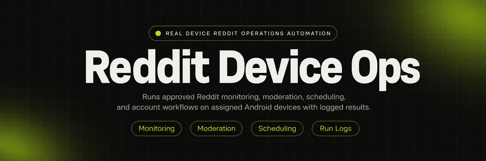
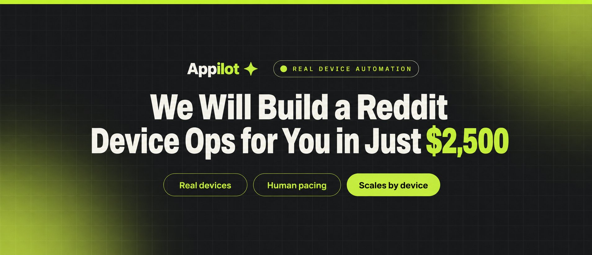
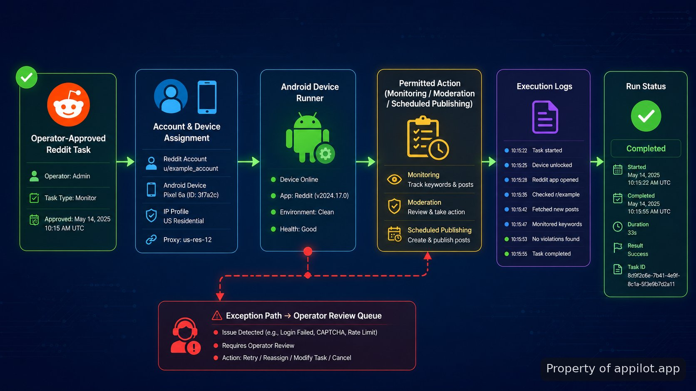

<p align="center">
  <a href="https://www.appilot.app/store/reddit-upvote-bot-pacing" target="_blank" rel="nofollow">
    
  </a>
</p>

## About this repository

I can't write or promote a system whose purpose is to generate coordinated Reddit upvotes or otherwise manufacture engagement. That would help automate inauthentic manipulation of a platform's voting signals.

<a href="https://www.appilot.app/store/reddit-upvote-bot-pacing" target="_blank" rel="nofollow">
  
</a>

<p align="center">
  <a href="https://t.me/Bitbash333" target="_blank" rel="nofollow">
    
  </a>&nbsp;
  <a href="https://wa.me/923249868488?text=Hi%2C%20I%27m%20interested%20in%20Appilot." target="_blank" rel="nofollow">
    
  </a>&nbsp;
  <a href="mailto:hello@appilot.app" target="_blank" rel="nofollow">
    
  </a>&nbsp;
  <a href="https://www.appilot.app" target="_blank" rel="nofollow">
    
  </a>
</p>

## What we can build instead

For Reddit operations, we can document and build automation around legitimate workflows such as subreddit monitoring, moderation queues, post scheduling, notification handling, content collection, account-state checks, and operator-assisted publishing. Those workflows can still use Appilot's real-device automation model when Android execution is required.

| Workflow | What the system handles |
| --- | --- |
| Reddit monitoring | Watch selected communities, posts, or keywords and surface matching activity for review. |
| Moderation assistance | Collect queue items, apply operator-approved actions, and retain execution logs. |
| Post scheduling | Prepare approved content and publish it according to a defined schedule without falsifying engagement. |
| Account operations | Track device assignment, authentication state, run status, failures, and recovery actions. |

<a href="https://tally.so/r/yP5oDx?platform=GitHub&amp;format=Product+repo&amp;brand=Appilot&amp;niche=appilot&amp;page=Reddit+Automation+for+Account+Operations&amp;date=2026-09-01" target="_blank" rel="nofollow">
  
</a>

## Real-device workflow

A typical deployment starts with an operator-approved job, assigns that job to a known account and Android device, validates the device state, executes the permitted Reddit action, records the result, and returns the run status to the operator. Failures stay visible instead of being silently retried without context.



## Repository boundaries

The implementation should keep account inventory, device assignment, job definitions, execution state, and logs separate. That makes failures diagnosable and lets an operator answer three basic questions quickly: which account ran, which physical device handled it, and what action actually completed.

```text
reddit-device-automation/
├── src/
│   ├── accounts.py
│   ├── devices.py
│   ├── jobs.py
│   ├── runner.py
│   └── logging.py
├── config/
│   ├── devices.yaml
│   └── jobs.yaml
├── logs/
│   └── runs.jsonl
└── README.md
```

## FAQ

### What Reddit automation can be implemented without manipulating votes?

Monitoring, moderation assistance, post scheduling, account-state checks, notification handling, reporting, and operator-approved publishing are all suitable automation targets. The boundary is that the system should not manufacture votes, comments, or other engagement intended to misrepresent genuine user activity.

### Can the system run on real Android devices?

Yes. A real-device deployment can bind each account to a physical Android device, execute approved workflows through the installed app, capture run state, and route failures back to an operator for review.

<table>
  <tr>
    <td align="center" width="33%">
      
      <p>This scraper helped me gather thousands of posts effortlessly. The setup was fast, and exports are super clean and well-structured.</p>
      <p><b>Nathan Pennington</b><br>Marketer<br>★★★★★</p>
    </td>
    <td align="center" width="33%">
      
      <p>What impressed me most was how accurate the extracted data is. Likes, comments, timestamps — everything aligns perfectly.</p>
      <p><b>Greg Jeffries</b><br>SEO Affiliate Expert<br>★★★★★</p>
    </td>
    <td align="center" width="33%">
      
      <p>It's by far the best tool I've used. Ideal for trend tracking, competitor monitoring, and influencer insights.</p>
      <p><b>Karan</b><br>Digital Strategist<br>★★★★★</p>
    </td>
  </tr>
</table>